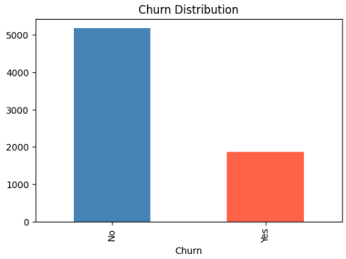
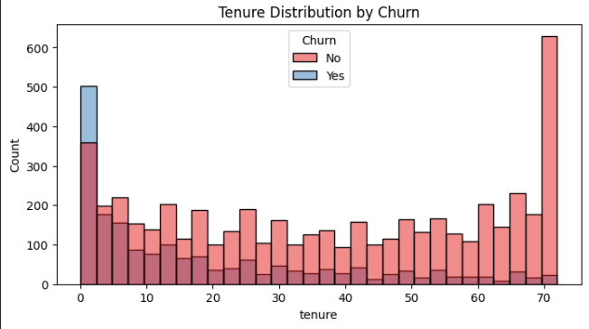
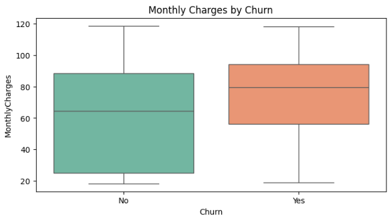
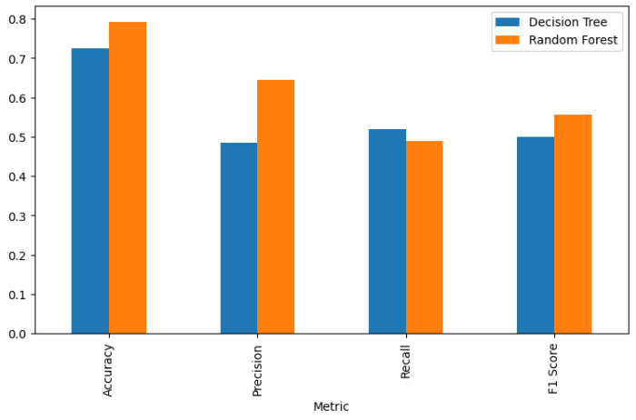
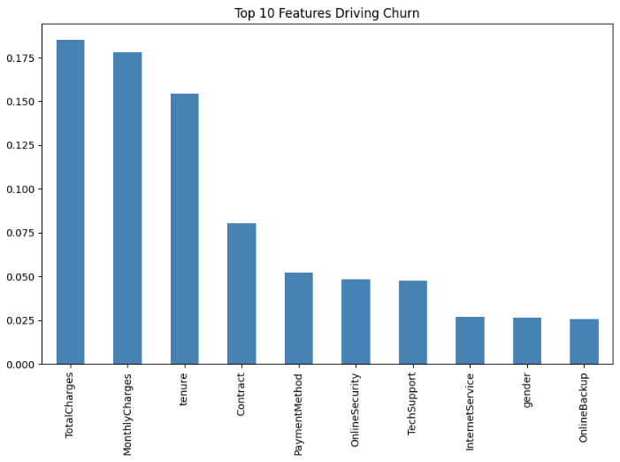
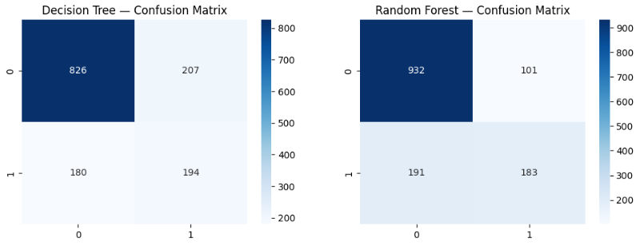

# 📊 Telco Customer Churn Prediction

Predicting customer churn in the telecommunications industry using Decision Tree and Random Forest classification models, following the CRISP-DM data mining methodology.

---

## 🎯 Business Question

> **Can we predict which customers are likely to churn, and what factors drive that decision?**

Understanding churn drivers enables businesses to proactively retain at-risk customers before they leave, reducing revenue loss and improving customer lifetime value.

---

## 📁 Project Structure

```
da-telco-churn-prediction/
│
├── data/
│   └── telco_churn_cleaned.csv        # Cleaned dataset ready for modeling
│
├── notebook/
│   └── telco_churn_analysis.ipynb     # Full Python analysis notebook (Google Colab)
│
├── orange/
│   └── telco_churn_workflow.ows       # Orange Mining visual workflow
│
├── images/
│   └── *.png                          # All charts and visualizations
│
└── README.md
```

---

## 🛠️ Tools & Technologies

| Tool | Purpose |
|------|---------|
| Python (Google Colab) | Data cleaning, modeling, evaluation |
| pandas, numpy | Data manipulation and preprocessing |
| scikit-learn | Machine learning models and metrics |
| matplotlib, seaborn | Data visualization |
| Orange Mining | Visual workflow and cross-validation |

---

## 📂 Dataset

- **Source:** [Telco Customer Churn — Kaggle](https://www.kaggle.com/datasets/blastchar/telco-customer-churn)
- **Records:** 7,043 customers
- **Features:** 21 columns (demographics, services, billing, churn status)
- **Target Variable:** Churn (Yes / No)

---

## 🔄 Methodology — CRISP-DM

| Phase | What Was Done |
|-------|--------------|
| Business Understanding | Defined churn prediction as the core objective |
| Data Understanding | Diagnostic EDA — identified null values, wrong data types, class imbalance |
| Data Preparation | Fixed TotalCharges type, dropped 11 null rows, encoded 15 categorical columns, 80/20 split |
| Modeling | Trained Decision Tree (baseline) and Random Forest (100 estimators) |
| Evaluation | Compared models on Accuracy, Precision, Recall, F1 Score, AUC |
| Deployment | Notebook + Orange workflow ready for CRM integration |

---

## 📊 Key Visualizations

### Churn Distribution


### Tenure Distribution by Churn


### Monthly Charges by Churn


### Model Comparison


### Feature Importance


### Confusion Matrices


---

## 📈 Results

### Python — 80/20 Train/Test Split

| Metric | Decision Tree | Random Forest | Winner |
|--------|--------------|---------------|--------|
| Accuracy | 72.49% | 79.25% | ✅ Random Forest |
| Precision | 48.38% | 64.44% | ✅ Random Forest |
| Recall | 51.87% | 48.93% | ✅ Decision Tree |
| F1 Score | 50.06% | 55.62% | ✅ Random Forest |

### Orange Mining — 5-Fold Cross-Validation

| Model | AUC | CA | F1 | Precision | Recall |
|-------|-----|----|----|-----------|--------|
| Decision Tree | 0.632 | 0.753 | 0.747 | 0.744 | 0.753 |
| Random Forest | **0.811** | **0.785** | **0.776** | **0.773** | **0.785** |

---

## 🔍 Top Features Driving Churn

1. **TotalCharges (0.185)** — Highest billing amounts correlate strongly with churn
2. **MonthlyCharges (0.178)** — High monthly bills drive customer dissatisfaction
3. **tenure (0.155)** — Short-tenure customers are at the highest risk

---

## 💡 Business Recommendations

1. **Target high-bill customers** — Offer loyalty discounts to customers above the $64.76 average monthly charge
2. **Focus on early-tenure customers** — Implement structured onboarding for customers in their first 10 months
3. **Promote long-term contracts** — Incentivize month-to-month customers to switch to annual contracts
4. **Deploy Random Forest for churn scoring** — Integrate into CRM to generate monthly churn risk scores

---

## 🚀 How to Run

### Python Notebook
1. Open the notebook in Google Colab: [](https://colab.research.google.com/drive/1W92zrdbgwsAlXyclrg8ozJqtYtZYeEYn?usp=sharing)
2. Upload `telco_churn_cleaned.csv` from the `data/` folder when prompted
3. Run all cells in order

### Orange Mining Workflow
1. Install [Orange Data Mining](https://orangedatamining.com)
2. Open `orange/telco_churn_workflow.ows`
3. Load `data/telco_churn_cleaned.csv` in the File widget
4. Set Churn column as target variable

---

## 👤 Author

**Mousa** — Business Intelligence & Data Analysis  
[LinkedIn](mousa-mohammad-7996b2193) | [GitHub](https://github.com/)

---

*Built with Python, scikit-learn, and Orange Mining*
